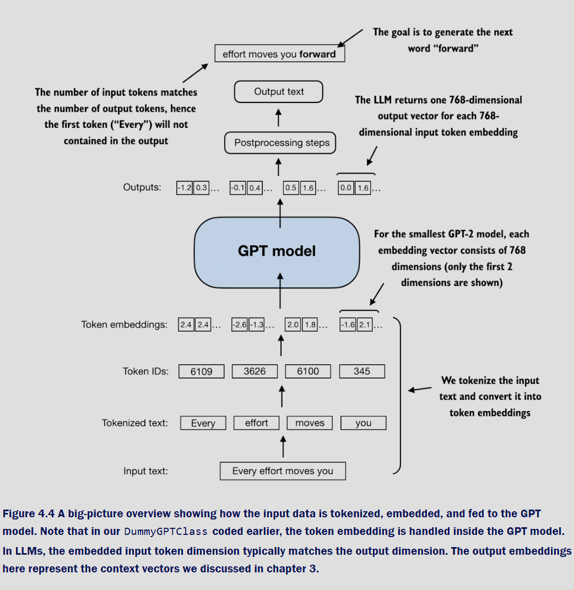
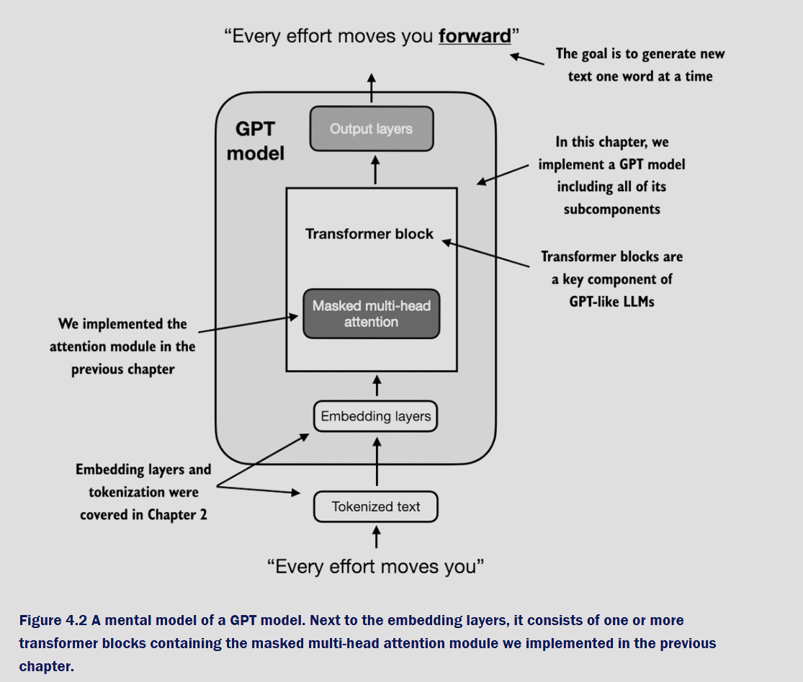

# Section 4.1 – GPT Model Architecture: The Big Picture

## Core Idea
Up to here, you’ve built **tokenizers** (Chapter 2) and **attention** pieces (Chapter 3). Section 4.1 wires these into a minimal, end-to-end **GPT skeleton** so you can verify the whole data path:

1) Text → token IDs  
2) Token IDs → embeddings (token + position)  
3) Embeddings → transformer block stack (placeholders here)  
4) Hidden states → logits over the vocabulary

> **Logits** = raw, unnormalized scores for each vocabulary token; they become probabilities after softmax.

---

## Overview Diagram
This figure shows how a sentence flows through the model:



- We **tokenize** `"Every effort moves you"` into IDs like `[6109, 3626, 6100, 345]`.  
  > **Tokenization** = mapping text chunks (words/subwords) to numeric IDs the model can process.

- IDs become **token embeddings**: learned 768-dimensional vectors (for GPT-2 small).  
  > **Embedding** = a learned vector that captures a token’s meaning/usage.

- The model outputs one 768-D vector per input token; these are turned into **logits** over the vocabulary.  
  > **Vocabulary** = the full set of tokens the model knows (50257 for GPT-2’s BPE).

---

## Mental Model (Top-Down)
A high-level block diagram of a GPT model:



- **Embedding layers** map token IDs into vectors and inject order information.
  > **Positional embeddings** provide token order because self-attention itself is order-agnostic.

- **Transformer block(s)** operate on the sequence with **masked multi-head attention** and an MLP.
  > **Masked** = causal; each token can only attend to itself and the past.  
  > **Multi-head** = several attention “specialists” run in parallel on different subspaces.

- **Output layers** convert hidden states to logits over the vocabulary.

---

## Minimal §4.1 Dummy GPT (scaffold)

> We implement only the *skeleton*: token embeddings, learned positional embeddings, dropout, a stack of identity “blocks” (stand-ins for real transformer blocks), final LayerNorm, and a linear LM head.

```python
import torch
import torch.nn as nn
import tiktoken

class DummyGPTModel(nn.Module):
    def __init__(self, cfg):
        super().__init__()
        self.tok_emb = nn.Embedding(cfg["vocab_size"], cfg["emb_dim"])
        self.pos_emb = nn.Parameter(torch.zeros(1, cfg["context_length"], cfg["emb_dim"]))
        self.drop    = nn.Dropout(cfg["drop_rate"])

        # Placeholder stack: real attention/MLP will come in later sections
        self.blocks  = nn.Sequential(*[IdentityBlock() for _ in range(cfg["n_layers"])])

        self.norm    = nn.LayerNorm(cfg["emb_dim"])
        self.head    = nn.Linear(cfg["emb_dim"], cfg["vocab_size"], bias=False)

        # Nice init for positions (optional)
        nn.init.normal_(self.pos_emb, mean=0.0, std=0.02)

    def forward(self, x):
        B, T = x.shape
        tok = self.tok_emb(x)          # (B, T, C)
        pos = self.pos_emb[:, :T, :]   # (1, T, C)
        x = self.drop(tok + pos)       # (B, T, C)
        x = self.blocks(x)             # (B, T, C) — identity for now
        x = self.norm(x)               # (B, T, C)
        logits = self.head(x)          # (B, T, V)
        return logits

class IdentityBlock(nn.Module):
    def forward(self, x):  # placeholder “transformer block”
        return x
```

> **LayerNorm** stabilizes training by normalizing features per token.  
> **Dropout** randomly disables units during training to reduce overfitting.

---

## Example: encode two sentences → run the model
This mirrors the book’s example batch and prints the shapes/logits so you can confirm the pipeline.

```python
# 1) Build the token batch
tokenizer = tiktoken.get_encoding("gpt2")
txt1 = "Every effort moves you"
txt2 = "Every day holds a"

batch = torch.stack([
    torch.tensor(tokenizer.encode(txt1)),
    torch.tensor(tokenizer.encode(txt2))
], dim=0)  # shape: (2, T)

print("Input token IDs:\n", batch)

# 2) Config and model
GPT_CONFIG_124M = {
    "vocab_size": 50257,
    "context_length": 1024,
    "emb_dim": 768,
    "n_heads": 12,     # not used in §4.1 scaffold
    "n_layers": 12,    # identity blocks for now
    "drop_rate": 0.1,
    "qkv_bias": False, # not used in §4.1 scaffold
}

torch.manual_seed(123)
model = DummyGPTModel(GPT_CONFIG_124M)

# 3) Forward pass
logits = model(batch)
print("Output shape:", logits.shape)
print("Logits (truncated view):\n", logits)
```

### Expected console outputs
- Input IDs (one row per sentence; 4 tokens each in this example):

```text
tensor([[6109, 3626, 6100,  345],
        [6109, 1110, 6622,  257]])
```

- Logits shape (B, T, V) = (2 sentences, 4 tokens, 50257 vocab):

```text
torch.Size([2, 4, 50257])
```

> Numbers inside the logits are random-looking because the model is untrained and blocks are identity. The goal in §4.1 is **shape sanity**: verify that text → tokens → embeddings → logits works.

---

## Why §4.1 matters
- Establishes the **end-to-end plumbing** of a GPT.  
- Confirms correct tensor **shapes** and the role of **token** and **positional** embeddings.  
- Prepares the scaffold so later sections can drop in real **masked multi-head attention** and **MLP** layers without changing I/O.
