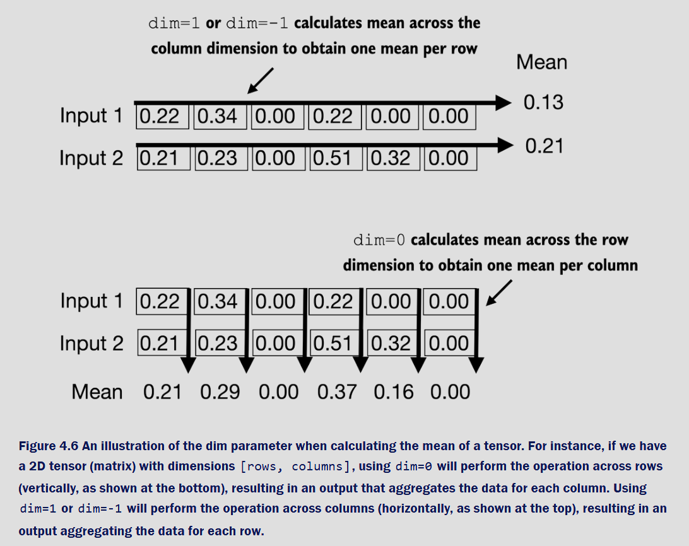

# Section 4.2 – Normalization Layers (LayerNorm), in depth

## What problem are we solving?
Deep nets can become numerically unstable: tiny changes in activations can either blow up (exploding) or shrink toward zero (vanishing). **Normalization** keeps activations in a safe range so gradients flow well and training converges faster.

> **Normalization** = rescaling activations to a controlled distribution (typically zero mean and unit variance).

---

## Visual intuition (per-token normalization)


Each circle (top) is one feature of a **single token’s** embedding after a layer. **LayerNorm** takes that token’s vector and:
1) subtracts its mean, 2) divides by its standard deviation → **zero mean, unit variance**, then
3) applies a learned **scale (γ)** and **shift (β)** to keep model capacity.

> In GPTs, a sequence has shape `(batch, seq_len, emb_dim)`. LayerNorm normalizes **across the last dimension** (`emb_dim`) for **each token independently**.

---

## How we implement it (your repo)

- `the_norm.py` — shows *why* we normalize (outputs vary in scale; normalized outputs are nicer).
- `status_quo.py` — a minimal, custom **LayerNorm** called `LayerUs`.
- This section’s code will later be used inside the transformer block.


---

## A quick “why” with numbers

From `the_norm.py` (trimmed to the core):

```python
import torch
import torch.nn as nn

torch.manual_seed(123)

# Two tokens, embedding dim = 5 (toy)
x = torch.randn(2, 5)

# Some layer that changes scale
layer = nn.Sequential(nn.Linear(5, 6), nn.ReLU())
y = layer(x)                           # shape: (2, 6)

# Per-token statistics BEFORE normalization
mean = y.mean(dim=-1, keepdim=True)    # (2, 1)
var  = y.var (dim=-1, keepdim=True)    # (2, 1)

# Normalize (zero mean, unit variance)
y_norm = (y - mean) / torch.sqrt(var + 1e-5)

# Check stats AFTER normalization (≈ 0, 1)
print("means:", y_norm.mean(-1))
print("vars: ", y_norm.var (-1))
```

> **Key point:** we normalize **each row** (each token) across its features. That’s why we use `dim=-1` (the feature axis).

---

## Axis/dimension choices (what does `dim` mean?)



- `dim=-1` or `dim=features_axis` = compute along the **embedding/features** dimension → one mean/variance **per token** (correct for LayerNorm).
- `dim=0` on a `(B, T, d)` tensor would aggregate **across batch** instead — that’s not LayerNorm.

> **LayerNorm = per-sample (per-token) normalization across features**.  
> (Contrast: BatchNorm = across the batch; that’s not used in GPTs.)

---

## Implementaion (`status_quo.py`)

Minimal, explicit implementation with learnable **γ** (scale) and **β** (shift):

```python
import torch
import torch.nn as nn

class LayerUs(nn.Module):
    def __init__(self, emb_dim: int, eps: float = 1e-5):
        super().__init__()
        self.eps   = eps
        self.scale = nn.Parameter(torch.ones (emb_dim))  # γ
        self.shift = nn.Parameter(torch.zeros(emb_dim))  # β

    def forward(self, x: torch.Tensor):
        # x can be (..., emb_dim). We normalize along the LAST axis.
        mean = x.mean(dim=-1, keepdim=True)
        var  = x.var (dim=-1, keepdim=True, unbiased=False)
        xhat = (x - mean) / torch.sqrt(var + self.eps)
        return self.scale * xhat + self.shift


if __name__ == "__main__":
    torch.manual_seed(123)
    x = torch.randn(2, 5)   # two tokens, 5-dim each
    ln = LayerUs(emb_dim=5)
    y  = ln(x)
    print("per-token means:", y.mean(-1))     # ≈ 0
    print("per-token vars: ", y.var (-1))     # ≈ 1
```
**Details worth noting**
- `unbiased=False` for `var` matches PyTorch’s `LayerNorm` behavior.
- `eps` avoids division by zero.
- `scale`/`shift` are per-feature parameters of length `emb_dim`; they **broadcast** across batch and sequence.

**Math** (for each token vector `x ∈ ℝ^d`):
- μ = (1/d) Σᵢ xᵢ  
- σ² = (1/d) Σᵢ (xᵢ − μ)²  
- `LayerNorm(x) = γ ⊙ (x − μ) / √(σ² + ε) + β`, with learnable γ, β ∈ ℝ^d

---

## Where LayerNorm sits in a GPT block


Modern LLMs typically use **Pre-Norm** blocks:
1) **LN → (Attention) → Residual add**  
2) **LN → (MLP)      → Residual add**

> Pre-Norm improves gradient flow in very deep stacks. We’ll slot the `LayerUs`/`nn.LayerNorm` at those LN positions when we finish the transformer block.


---

## Worked example on a 3-D tensor

To cement axis handling for real GPT shapes `(B, T, d)`:

```python
import torch
torch.manual_seed(1)

B, T, d = 2, 4, 6
x = torch.randn(B, T, d)

# LayerNorm along last dim: per-token stats
mu  = x.mean(-1, keepdim=True)     # (B, T, 1)
var = x.var (-1, keepdim=True, unbiased=False)
xhat = (x - mu) / torch.sqrt(var + 1e-5)

print("per-token means (≈0):", xhat.mean(-1))
print("per-token vars  (≈1):", xhat.var (-1))
```

---

## How this plugs into your model

In §4.1 we created a `toiletGPT`/`DummyGPTModel` scaffold. In §4.2 you now have a reliable normalization layer (`LayerUs` or `nn.LayerNorm`) to drop:
- **Before attention** and **before MLP** inside `ToiletTransformerBlock`, enabling deep stacks to train stably.

**Mental checklist for integration**
1) Ensure inputs are `(B, T, d_model)`.  
2) Apply LN with `normalized_shape=d_model` (or your `LayerUs(emb_dim=d_model)`).  
3) Use the same LN in both sublayers (attention and MLP) with residual connections.

---

## Takeaways
- LayerNorm normalizes **per token across features**, independent of batch size and sequence length — perfect for autoregressive transformers.
- After normalization, learnable **γ/β** restore representational power.
- Correct **axis (`dim=-1`)** and **numerical handling (`eps`, dtype)** are crucial.
- This block is foundational: the next sections (GELU, MLP, residual/shortcut, full transformer block) stack on top of it.
