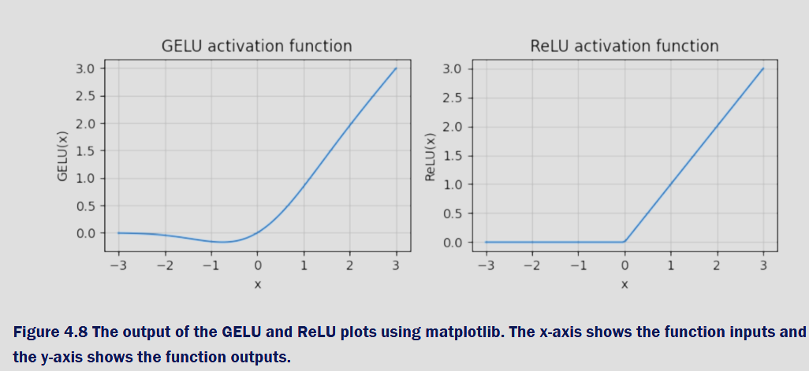

# Section 4.3 — GELU and the Feed-Forward Network (FFN)

This section adds two core ingredients to each Transformer block:

1) **GELU (Gaussian Error Linear Unit)** — the activation used in modern LLMs.  
   > Activation = a non-linear function applied element-wise so the network can model complex patterns.

2) **Feed-Forward Network (FFN)** — a **position-wise** MLP: expand the embedding **4×**, apply GELU, then project back.

> Position-wise = applied to each token independently (same weights shared across all tokens/positions).

---

## 1) GELU in practice (`Elmers`)

Your `Elmers` module implements the widely used tanh-based GELU approximation:

```python
class Elmers(nn.Module):
    """
    GELU (Gaussian Error Linear Unit) activation function implementation.

    GELU is a smooth, non-monotonic activation that combines properties of
    ReLU and dropout. It's commonly used in GPT/BERT.
    Approximation:
      GELU(x) = 0.5 * x * (1 + tanh(√(2/π) * (x + 0.044715 * x^3)))
    """
    def forward(self, x):
        return 0.5 * x * (
            1 + torch.tanh(torch.sqrt(torch.tensor(2.0/torch.pi)) *
            (x + 0.044715 * torch.pow(x, 3)))
        )
```

### Why GELU (vs. ReLU)?
- **ReLU** hard-zeros all negatives → piecewise linear.
- **GELU** softly gates negatives based on their magnitude → smoother gradients; empirically better in large Transformers.



> Visual: GELU (left) passes small negatives; ReLU (right) clips them to 0.

**Sanity check (from your test harness):**

```python
gelu = Elmers()
test_vals = torch.tensor([-2.0, -1.0, 0.0, 1.0, 2.0])
print(gelu(test_vals))  # expected approx: [-0.0454, -0.1588, 0.0, 0.8412, 1.9546]
```

Expected output (approximate):

```text
tensor([-0.0454, -0.1588,  0.0000,  0.8412,  1.9546])
```

---

## 2) The Feed-Forward Network (`ConveyorBelt`)

Your FFN is a **two-layer MLP** with GELU in the middle:
1) **Expand** from `emb_dim` → `4*emb_dim`  
2) **GELU**  
3) **Project back** `4*emb_dim` → `emb_dim`

> The **4× expansion** is a common Transformer design (GPT, BERT) that gives the block extra non-linear capacity without permanently growing the model width.

```python
class ConveyorBelt(nn.Module):
    """
    Feed-Forward Network (FFN) layer used in transformer architectures.

    Position-wise FFN within each Transformer block:
      1) Linear: emb_dim -> 4 * emb_dim
      2) GELU activation
      3) Linear: 4 * emb_dim -> emb_dim
    """
    def __init__(self, cfg):
        self.layers = nn.Sequential(
            nn.Linear(cfg["emb_dim"], 4 * cfg["emb_dim"]),  # expand
            Elmers(),                                       # GELU
            nn.Linear(4 * cfg["emb_dim"], cfg["emb_dim"]),  # contract
        )

    def forward(self, x):
        """
        x shape: (batch_size, seq_len, emb_dim)
        Returns same shape (position-wise processing).
        """
        return self.layers(x)
```

**Flow and shapes (batch, seq, emb):**


**Intuition — “expand then compress”:**


---

## 3) Example run (from your `__main__` test)

Your script validates that the FFN keeps shape `(B, T, d)` and that GELU behaves as expected.

```python
if __name__ == "__main__":
    # GPT-124M-like config
    GPT_CONFIG_124M = {
        "vocab_size": 50257,
        "context_length": 1024,
        "emb_dim": 768,
        "n_heads": 12,
        "n_layers": 12,
        "drop_rate": 0.1,
        "qkv_bias": False,
    }

    torch.manual_seed(123)
    ff = ConveyorBelt(GPT_CONFIG_124M)

    # Dummy input: (batch=2, seq_len=3, emb_dim=768)
    x = torch.randn(2, 3, GPT_CONFIG_124M["emb_dim"])

    output = ff(x)
    print(f"Input shape:  {x.shape}")      # torch.Size([2, 3, 768])
    print(f"Output shape: {output.shape}") # torch.Size([2, 3, 768])

    assert output.shape == x.shape
    print("✓ Shape preservation test passed!")

    # GELU spot check
    gelu = Elmers()
    vals = torch.tensor([-2.0, -1.0, 0.0, 1.0, 2.0])
    outs = gelu(vals)
    print("GELU test values:", vals)
    print("GELU outputs:    ", outs)
```

Expected console:

```text
Input shape:  torch.Size([2, 3, 768])
Output shape: torch.Size([2, 3, 768])
✓ Shape preservation test passed!
GELU test values: tensor([-2., -1.,  0.,  1.,  2.])
GELU outputs:     tensor([-0.0454, -0.1588,  0.0000,  0.8412,  1.9546])
```

---

## How this fits the Transformer block

Inside each block (after LayerNorm), tokens flow through:
- **Self-Attention** (token-to-token mixing)  
- **FFN** (token-wise non-linear transformation)

Both sublayers use residual connections and are **position-wise normalized** (LayerNorm). The FFN does *not* mix information across tokens — that’s attention’s job; the FFN reshapes each token’s features in a richer space.

---

## Takeaways
- **GELU** provides smooth, magnitude-aware gating that outperforms ReLU in large LMs.  
- The **FFN** gives powerful **non-linear feature transformation** by expanding to `4*emb_dim` then compressing back, and it **preserves (B, T, d)**.  
- This “GELU + two linears” stack, applied position-wise, is the second half of every Transformer block.
