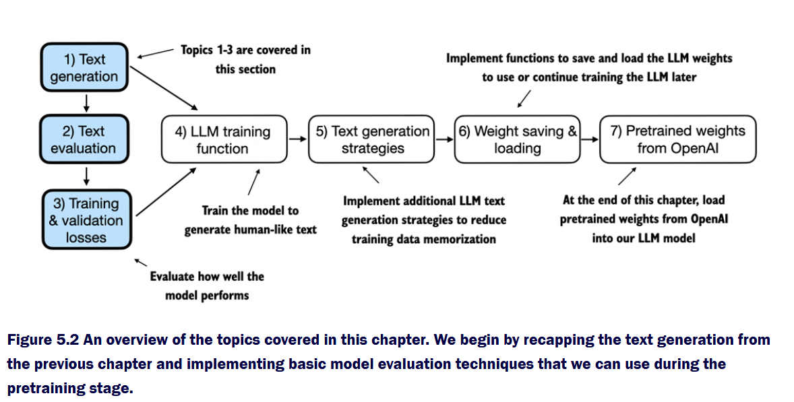
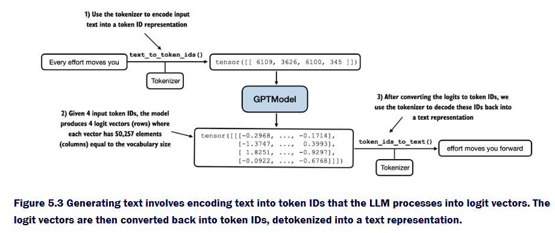

# Section 5.1 — Pretraining Foundations

## Overview

This section introduces the **pretraining foundation** for a Large Language Model (LLM).  
It explains how the model predicts the next token in a sequence, evaluates its predictions,  
and prepares datasets for training and validation.

---

## 1. Text Generation Process



**Figure 5.2** shows the overall structure of this section.  
We focus on the first three parts:  
1. Text generation  
2. Text evaluation  
3. Training and validation losses  

---

### Encoding and Model Output



**Figure 5.3** illustrates the text generation pipeline:

1. The input text is **encoded** into token IDs using a tokenizer.
2. The model converts these tokens into **logit vectors**, which are unnormalized scores for each possible next token.
3. The logits are converted back to token IDs and decoded into text.

Example:

```python
text = "Every effort moves you"
tokens = tokenizer.encode(text)
# -> [6109, 3626, 6100, 345]
```

The logits produced by the model have this shape:

```python
logits.shape = (batch_size, sequence_length, vocab_size)
```

Where:
- **batch_size** = number of samples in parallel  
- **sequence_length** = number of tokens in each input  
- **vocab_size** = total number of possible tokens (≈50k for GPT-2)

---

### Mapping Probabilities to Tokens


**Figure 5.4** breaks down how probabilities map to the most likely token:

1. Each input token produces a probability distribution across the vocabulary (via softmax).  
2. The token with the **highest probability** (found via `argmax`) becomes the next token in the sequence.  
3. These token IDs are converted back into words using the inverse vocabulary.

Example:

```python
probs = torch.softmax(logits, dim=-1)
predicted_token = torch.argmax(probs, dim=-1)
```

---

## 2. Evaluating Text Generation


**Figure 5.5** introduces the concept of *evaluation*,  
which measures how well the model predicts the next token.

Instead of just generating text, the model learns by comparing its predictions to the **target sequence**,  
which is simply the input text shifted by one position.

Example:

```python
inputs  = ["every effort moves"]
targets = ["effort moves you"]
```

---

### Understanding Untrained Predictions


**Figure 5.6** shows what happens before training:
- The model’s logits are random.
- Its predicted probabilities for the correct tokens are nearly uniform.
- Training aims to make the model assign **higher probabilities** to the correct next tokens.

---

### Step-by-Step Loss Calculation


**Figure 5.7** walks through how the model computes loss:

| Step | Operation | Description |
|------|------------|-------------|
| 1 | **Logits** | Raw model output for each token. |
| 2 | **Softmax** | Converts logits into probability distributions. |
| 3 | **Target probabilities** | Selects probabilities of the correct next tokens. |
| 4 | **Log probabilities** | Applies logarithm to stabilize training. |
| 5 | **Average log prob** | Takes the mean value across all tokens. |
| 6 | **Negative average log prob** | Final training loss (cross-entropy). |

Example (PyTorch):
```python
loss = torch.nn.functional.cross_entropy(logits.flatten(0,1), targets.flatten())
```

The lower the loss, the better the model is at predicting the next token.

---

## 3. Dataset Preparation

### Loading and Tokenizing the Dataset

The dataset (`the-verdict.txt`) is read, tokenized, and split into training and validation sets.

```python
train_ratio = 0.9
split_idx = int(train_ratio * len(text_data))
train_data = text_data[:split_idx]
val_data   = text_data[split_idx:]
```

This ensures 90% of the text is used for training and 10% for validation.

---

### Creating Data Loaders


We use the function `spawn_dataloader` from **data.py** to divide the tokenized text  
into overlapping chunks of `context_length` tokens.

```python
train_loader = spawn_dataloader(
    train_data,
    batch_size=2,
    max_length=GPT_CONFIG_124M["context_length"],
    stride=GPT_CONFIG_124M["context_length"],
    tokenizer=tokenizer,
    shuffle=True,
    drop_last=True
)
```

- **Context length**: The number of tokens the model processes at once.  
- **Stride**: How many tokens to move forward between chunks. Smaller stride = more overlap.  
- **Drop last**: Ensures batch sizes are consistent.  

**Figure 5.9** shows how stride affects batching:  
Stride of 1 → heavy overlap, stride of 4 → less overlap and fewer batches.

---

## 4. Calculating Training and Validation Loss

We define two functions:

### Batch-Level Loss

```python
def calc_loss_batch(x, y, model, device):
    logits = model(x.to(device))
    loss = F.cross_entropy(logits.flatten(0,1), y.flatten().to(device))
    return loss
```

### Averaged Loss Across the Loader

```python
def calc_loss_loader(loader, model, device):
    total_loss = 0
    for x, y in loader:
        total_loss += calc_loss_batch(x, y, model, device).item()
    return total_loss / len(loader)
```

Then compute both training and validation losses:

```python
with torch.no_grad():
    train_loss = calc_loss_loader(train_loader, model, device)
    val_loss   = calc_loss_loader(val_loader, model, device)

print("Training loss:", train_loss)
print("Validation loss:", val_loss)
```

Typical output:
```
Training loss: 10.9875
Validation loss: 10.9811
```

These high values indicate the model has not been trained yet — it is still producing random next-token predictions.

---

## Summary Table

| Concept | Meaning |
|----------|----------|
| **Tokenization** | Converts raw text into token IDs for the model. |
| **Logits** | Raw predictions before normalization. |
| **Softmax** | Converts logits into probabilities. |
| **Argmax** | Selects the token with the highest probability. |
| **Cross-Entropy Loss** | Measures prediction accuracy using probabilities of correct tokens. |
| **Context Length** | Number of tokens the model processes in one window. |
| **Stride** | Overlap control for dataset chunking. |
| **Training vs Validation Loss** | Evaluates how well the model learns and generalizes. |

---

## Section Summary

Section 5.1 builds the essential groundwork for pretraining:
- The model is initialized (using `Toilet`).
- Text is tokenized and passed through the model for predictions.
- The loss is computed manually and verified via cross-entropy.
- The dataset (`the-verdict.txt`) is split and fed into data loaders.

By the end of this section, the model can:
1. Encode and decode text with tokens.
2. Generate token predictions.
3. Compute evaluation metrics (loss).
4. Prepare training-ready data loaders for use in **Section 5.2**.
