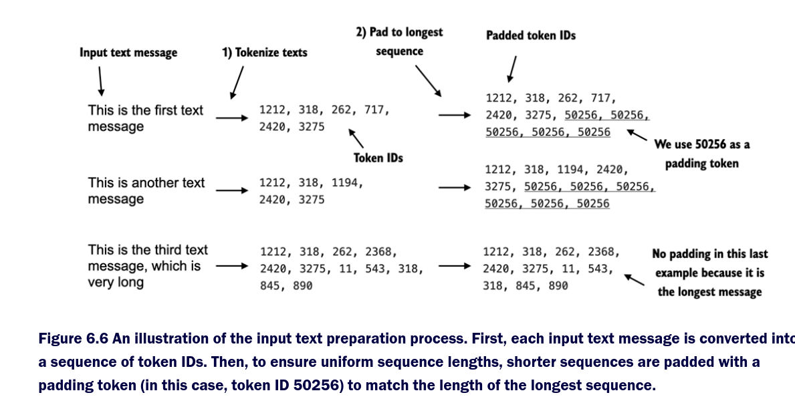
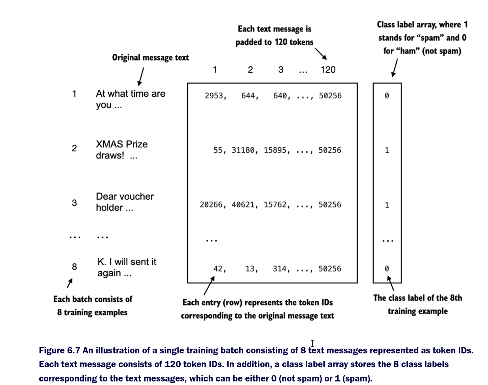

# ⚙️ Chapter 6.3 — Building PyTorch Datasets and DataLoaders

## Overview
Chapter **6.3** of *Build a Large Language Model (From Scratch)* extends the dataset work from Chapter 6.2 by integrating the processed **spam classification data** into **PyTorch’s Dataset and DataLoader** framework.  
This allows efficient batching, tokenization, and padding of text messages for model training — just like how language models handle data internally.

---

## 1️⃣ Tokenizing and Padding Messages
Each SMS text message is converted into a sequence of **token IDs** using the GPT-2 tokenizer from the `tiktoken` library.  
The padding token **50256** (`<|endoftext|>`) is used to make all sequences the same length.

```
import tiktoken

tokenizer = tiktoken.get_encoding("gpt2")
print(tokenizer.encode("<|endoftext|>", allowed_special={"<|endoftext|>"}))
```

This ensures uniform tensor dimensions, which are essential for efficient GPU batching.



---

## 2️⃣ Creating the `SpamDataset` Class
The custom dataset class handles:
- Loading the CSV files (`train.csv`, `validation.csv`, `test.csv`).
- Tokenizing the “Text” column.
- Padding or truncating each message to a fixed `max_length`.
- Returning PyTorch tensors for both input tokens and labels.

```
import torch
from torch.utils.data import Dataset
import pandas as pd

class SpamDataset(Dataset):
    def __init__(self, csv_file, tokenizer, max_length=None, pad_token_id=50256):
        self.data = pd.read_csv(csv_file)
        self.encoded_texts = [tokenizer.encode(text) for text in self.data["Text"]]

        if max_length is None:
            self.max_length = self._longest_encoded_length()
        else:
            self.max_length = max_length

        self.encoded_texts = [
            enc[:self.max_length] for enc in self.encoded_texts
        ]
        self.encoded_texts = [
            enc + [pad_token_id] * (self.max_length - len(enc))
            for enc in self.encoded_texts
        ]

    def __len__(self):
        return len(self.data)

    def __getitem__(self, index):
        encoded = self.encoded_texts[index]
        label = self.data.iloc[index]["Label"]
        return torch.tensor(encoded, dtype=torch.long), torch.tensor(label, dtype=torch.long)

    def _longest_encoded_length(self):
        return max(len(enc) for enc in self.encoded_texts)
```

Once initialized, the training dataset determines the **longest sequence length**, which is reused for the validation and test datasets for consistency.

```
train_dataset = SpamDataset("train.csv", tokenizer)
val_dataset = SpamDataset("validation.csv", tokenizer, max_length=train_dataset.max_length)
test_dataset = SpamDataset("test.csv", tokenizer, max_length=train_dataset.max_length)

print("Max sequence length:", train_dataset.max_length)
```

---

## 3️⃣ Creating DataLoaders
To efficiently feed the model during training, the datasets are wrapped into PyTorch **DataLoaders**, which automatically handle batching and shuffling.

```
from torch.utils.data import DataLoader

num_workers = 0
batch_size = 8
torch.manual_seed(123)

train_loader = DataLoader(train_dataset, batch_size=batch_size, shuffle=True, num_workers=num_workers, drop_last=True)
val_loader = DataLoader(val_dataset, batch_size=batch_size, shuffle=False, num_workers=num_workers)
test_loader = DataLoader(test_dataset, batch_size=batch_size, shuffle=False, num_workers=num_workers)
```

When tested, a batch contains **8 examples**, each padded to **120 tokens**, producing tensors shaped:
- Input: `[8, 120]`
- Labels: `[8]`



---

## 4️⃣ How It Works
1. **Tokenization:** Converts text to GPT-2 token IDs.  
2. **Padding:** Adds token `50256` to match the longest message.  
3. **Batching:** Groups examples into equal-sized mini-batches for efficient GPU processing.  
4. **Label Encoding:** Associates each input with its class (0 = ham, 1 = spam).  

---

## 🧠 Key Takeaways
| Step | Purpose |
|------|----------|
| **Tokenizer** | Converts text messages into numerical token IDs. |
| **Padding** | Ensures all sequences have the same length (using ID 50256). |
| **Dataset** | Custom class to organize, pad, and return tensors. |
| **DataLoader** | Automates batching and shuffling for model input. |

---

## 📊 Example Batch Summary
Each training batch (as shown in Figure 6.7) contains:
- **8 messages** (`batch_size=8`)  
- **120 tokens per message** (`max_length=120`)  
- **Binary labels:** 0 = ham, 1 = spam  

This prepares the data pipeline for the **fine-tuning phase** that begins in the next chapter.

---

**Summary:**  
> Chapter 6.3 connects the processed SMS spam dataset with PyTorch’s `Dataset` and `DataLoader` infrastructure.  
> It mirrors how text is handled in real LLM pipelines: tokenized, padded, batched, and paired with class labels — setting the stage for model training.
