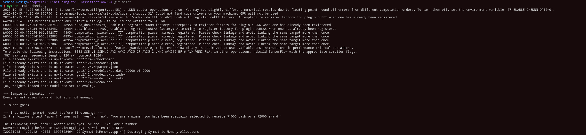

# 🚀 Chapter 6.4 — Testing and Loading Pretrained GPT-2 for Finetuning

## Overview
Chapter **6.4** of *Build a Large Language Model (From Scratch)* focuses on verifying that a **pretrained GPT-2 model** can be successfully loaded, configured, and tested before performing finetuning.  
The chapter demonstrates how to download model weights, check dataset compatibility, and run text generation to confirm that the model is functioning as intended.

---

## 1️⃣ Setting Up the Model Configuration
The configuration defines the base GPT-2 model type and its architecture. Each variant (Small, Medium, Large, XL) has different layer, head, and embedding sizes.

???
CHOOSE_MODEL = "gpt2-small (124M)"
INPUT_PROMPT = "Every effort moves"

BASE_CONFIG = {
    "vocab_size": 50257,
    "context_length": 1024,
    "drop_rate": 0.0,
    "qkv_bias": True
}

model_configs = {
    "gpt2-small (124M)": {"emb_dim": 768,  "n_layers": 12, "n_heads": 12},
    "gpt2-medium (355M)": {"emb_dim": 1024, "n_layers": 24, "n_heads": 16},
    "gpt2-large (774M)": {"emb_dim": 1280, "n_layers": 36, "n_heads": 20},
    "gpt2-xl (1558M)": {"emb_dim": 1600, "n_layers": 48, "n_heads": 25}
}

BASE_CONFIG.update(model_configs[CHOOSE_MODEL])
???

This step merges the chosen model's configuration into the base parameters, ensuring the architecture matches the pretrained checkpoint.

---

## 2️⃣ Verifying Dataset Compatibility
Before loading the model, the script checks whether the **maximum tokenized length** in the dataset fits within the GPT-2 context window.

???
assert train_dataset.max_length <= BASE_CONFIG["context_length"], (
    f"Dataset length {train_dataset.max_length} exceeds model's context length "
    f"{BASE_CONFIG['context_length']}."
)
???

If the dataset contains longer sequences than the model can handle, an error is raised suggesting reinitialization with a smaller maximum length.

---

## 3️⃣ Loading Pretrained GPT-2 Weights
The pretrained weights are downloaded and loaded using helper functions.  
These functions retrieve files like `encoder.json`, `hparams.json`, and `model.ckpt` from OpenAI’s GPT-2 checkpoints.

???
from resources.loading import download_and_load_gpt2, load_weights_into_gpt
from resources.past_chap import Toilet, generate_text_simple

model_size = CHOOSE_MODEL.split(" ")[-1].lstrip("(").rstrip(")")
settings, params = download_and_load_gpt2(model_size=model_size, models_dir="gpt2")

model = Toilet(BASE_CONFIG)
load_weights_into_gpt(model, params)
model.eval()
???

Once loaded, console output confirms:
- All GPT-2 checkpoint files exist and are up to date.
- The model has been set to evaluation mode.

---

## 4️⃣ Sanity Check — Text Generation
To confirm successful weight loading, a simple generation test is performed.

???
text_1 = "Every effort moves you"
token_ids = generate_text_simple(
    model=model,
    idx=text_to_token_ids(text_1, tokenizer),
    max_new_tokens=15,
    context_size=BASE_CONFIG["context_length"]
)
print(token_ids_to_text(token_ids, tokenizer))
???

**Expected Output Example**

Every effort moves forward, but it's not enough.  
I'm not going...

This demonstrates that the model has loaded correctly and can generate fluent, coherent English text.

---

## 5️⃣ Instruction Prompt Test — Spam Classification Example
To show the model’s pre-finetuning limitations, a task prompt is used to see whether GPT-2 can follow explicit instructions.

???
text_2 = (
    "Is the following text 'spam'? Answer with 'yes' or 'no': "
    "'You are a winner you have been specially selected "
    "to receive $1000 cash or a $2000 award.'"
)
token_ids = generate_text_simple(
    model=model,
    idx=text_to_token_ids(text_2, tokenizer),
    max_new_tokens=23,
    context_size=BASE_CONFIG["context_length"]
)
print(token_ids_to_text(token_ids, tokenizer))
???

**Observed Output Example**

Is the following text 'spam'? Answer with 'yes' or 'no':  
'You are a winner you have been specially selected...'

Here the model mostly repeats the prompt instead of providing an answer.  
This illustrates that GPT-2, as pretrained, doesn’t inherently know how to follow task instructions — highlighting the need for finetuning.

---

## 🧠 Key Takeaways

| Step | Purpose |
|------|----------|
| **Model Config** | Select and define GPT-2 variant (Small, Medium, Large, XL). |
| **Dataset Check** | Ensure message lengths fit within model’s context window. |
| **Weight Loading** | Download and initialize pretrained GPT-2 weights. |
| **Sanity Test** | Confirm correct model behavior via text generation. |
| **Instruction Test** | Demonstrate that base GPT-2 cannot follow task instructions yet. |

---

## 🧩 Chapter Context
This chapter marks the transition from **loading a pretrained model** to **finetuning for classification**.  
By confirming that GPT-2 generates coherent text but fails at instruction-based reasoning, it lays the groundwork for the supervised finetuning process in the next chapter.

---

**Summary**  
> Chapter 6.4 verifies that GPT-2 has been correctly initialized and loaded.  
> It demonstrates that while pretrained GPT-2 can generate fluent text, it cannot yet perform classification or follow instructions — motivating the need for finetuning in the next section.
 test
 