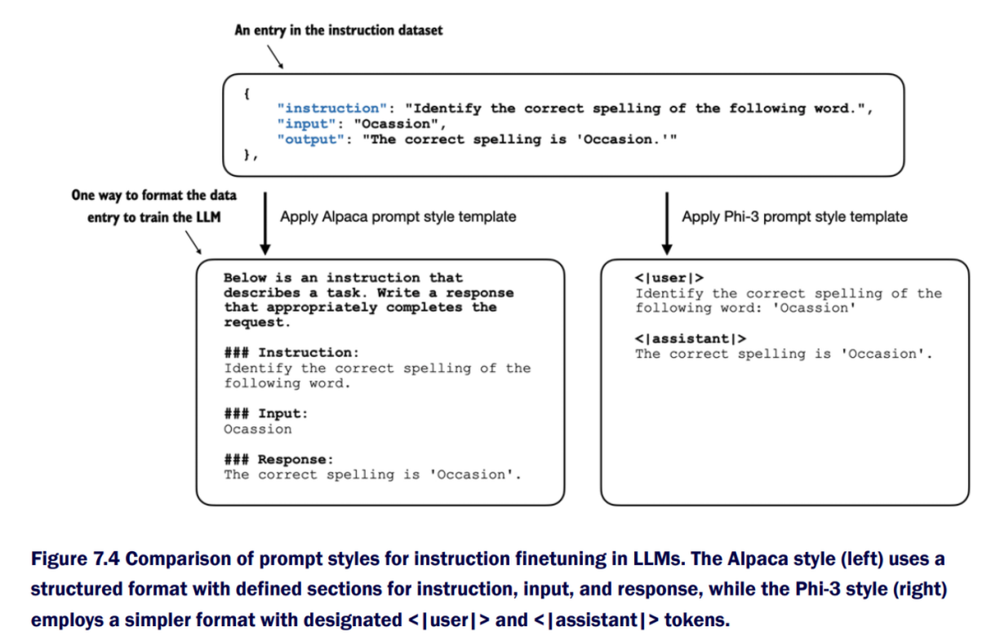

## 🧩 Chapter 7.2 — Instruction Dataset and Prompt Formatting

### Overview
Chapter 7.2 introduces **instruction finetuning**, or *supervised instruction finetuning (SFT)* — a process that teaches a language model to follow human-written instructions.  
The chapter’s focus is preparing and formatting an **instruction-based dataset** to train models like Alpaca and Phi-3.  

Key steps:
1. **Download and inspect** the dataset.  
2. **Format entries** into model-readable instruction prompts.  
3. **Split the dataset** for training, validation, and testing.  

---

### 1. Downloading and Loading the Dataset

The dataset contains **1,100 samples**, each with three fields:
- `"instruction"` — what the model should do  
- `"input"` — optional supporting text or data  
- `"output"` — the expected answer  

Example:
```
{
    "instruction": "Identify the correct spelling of the following word.",
    "input": "Occassion",
    "output": "The correct spelling is 'Occasion.'"
}
```

The helper function `download_and_load_file()` downloads this JSON file if missing, then reads it into memory.

**Output:**
```
Number of entries: 1100
```

---

### 2. Inspecting the Data

Each record can either contain an input or omit it entirely.  
For example:

```
{'instruction': "What is an antonym of 'complicated'?",
 'input': '',
 'output': "An antonym of 'complicated' is 'simple.'"}
```

This shows that not every instruction requires extra context—some are self-contained.

---


### 3. Prompt Formatting — Alpaca Style

The function `format_input(entry)` transforms dataset entries into **Alpaca-style prompts** for supervised finetuning.  
It structures each example with clear headers for readability:

```
Below is an instruction that describes a task. Write a response that appropriately completes the request.

### Instruction:
Identify the correct spelling of the following word.

### Input:
Occassion
```

If the `"input"` field is empty, the “### Input” block is omitted.  
During training, the target text is appended as:

```
### Response:
The correct spelling is 'Occasion.'
```

This format helps the model understand the relationship between instructions and desired answers.

---

### 4. Alternative — Phi-3 Style

The **Phi-3 format** offers a simpler, token-based structure similar to modern chat models:

```
<|user|>
Identify the correct spelling of the following word: 'Occassion'

<|assistant|>
The correct spelling is 'Occasion.'
```

While Alpaca uses human-readable headers, Phi-3 uses speaker tokens for compactness and conversational training.

---

### 5. Partitioning the Dataset

Before fine-tuning, the dataset is split into **training**, **validation**, and **test** subsets to ensure fair evaluation.

| Split | Percentage | Count |
|:------|:------------|:------|
| Training | 85% | 935 |
| Validation | 5% | 55 |
| Test | 10% | 110 |

```
Training set length: 935  
Validation set length: 55  
Test set length: 110
```

---

### 🔍 Summary

| Concept | Description |
|----------|--------------|
| **Goal** | Prepare and format instruction data for fine-tuning LLMs. |
| **Dataset** | 1,100 samples with `instruction`, `input`, `output` fields. |
| **Formatting** | Alpaca or Phi-3 style prompts for supervised learning. |
| **Core Function** | `format_input(entry)` — builds model-ready prompts. |
| **Split Ratio** | 85/10/5 for training, testing, and validation. |

---

### 💡 Takeaway
Chapter 7.2 transforms raw instruction data into **structured training prompts**, bridging data preprocessing and supervised instruction finetuning.  
By converting text into Alpaca- or Phi-3-style formats, the model can learn to follow instructions naturally — a critical step toward building instruction-tuned LLMs.
